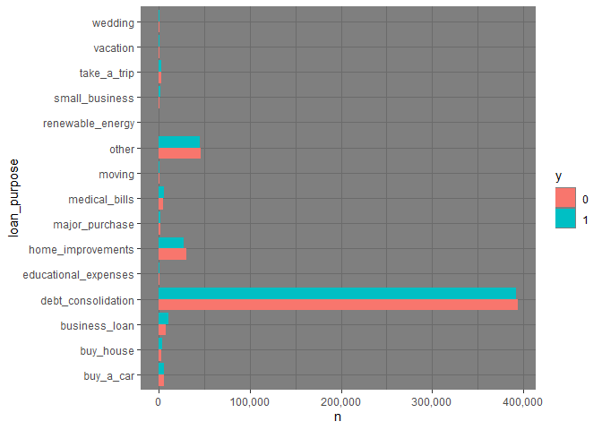

Užkrauname reikalingas bibliotekas


```r
library(tidyverse)
library(knitr)
```

Generuojant ataskaitą galima failo neskaityti kiekvieną kartą iš naujo - cache=TRUE. Nenorint klaidų/informacinių pranešimų pridedame message=FALSE ir warning=FALSE.


```r
df <- read_csv("../../../project/1-data/train_data.csv")
```

Duomenų failo dimensijos:


```r
dim(df)
```

```
## [1] 1000000      17
```
# Kintamųjų apžvalga


(dėl gražesnio spaudinimo, naudojame funkciją kable() ir išdaliname kintamuosius į kelias eilutes)


```r
summary(df[1:6])
```

```
##        id                y       amount_current_loan     term          
##  Min.   :      1   Min.   :0.0   Min.   : 10802      Length:1000000    
##  1st Qu.: 250001   1st Qu.:0.0   1st Qu.:174394      Class :character  
##  Median : 500001   Median :0.5   Median :269676      Mode  :character  
##  Mean   : 500001   Mean   :0.5   Mean   :316659                        
##  3rd Qu.: 750000   3rd Qu.:1.0   3rd Qu.:435160                        
##  Max.   :1000000   Max.   :1.0   Max.   :789250                        
##  credit_score       loan_purpose      
##  Length:1000000     Length:1000000    
##  Class :character   Class :character  
##  Mode  :character   Mode  :character  
##                                       
##                                       
## 
```


```r
summary(df[7:13]) %>%
  kable()
```


|   |yearly_income     |home_ownership   | bankruptcies  |years_current_job | monthly_debt  |years_credit_history |months_since_last_delinquent |
|:--|:-----------------|:----------------|:--------------|:-----------------|:--------------|:--------------------|:----------------------------|
|   |Min.   :    76627 |Length:1000000   |Min.   :0.0000 |Min.   : 0.00     |Min.   :     0 |Min.   : 4.0         |Min.   :  0.0                |
|   |1st Qu.:   825797 |Class :character |1st Qu.:0.0000 |1st Qu.: 3.00     |1st Qu.: 10324 |1st Qu.:13.0         |1st Qu.: 16.0                |
|   |Median :  1148550 |Mode  :character |Median :0.0000 |Median : 6.00     |Median : 16319 |Median :17.0         |Median : 32.0                |
|   |Mean   :  1344805 |NA               |Mean   :0.1192 |Mean   : 5.88     |Mean   : 18550 |Mean   :18.1         |Mean   : 34.9                |
|   |3rd Qu.:  1605899 |NA               |3rd Qu.:0.0000 |3rd Qu.:10.00     |3rd Qu.: 24059 |3rd Qu.:22.0         |3rd Qu.: 51.0                |
|   |Max.   :165557393 |NA               |Max.   :7.0000 |Max.   :10.00     |Max.   :435843 |Max.   :70.0         |Max.   :176.0                |
|   |NA's   :219439    |NA               |NA's   :1805   |NA's   :45949     |NA             |NA                   |NA's   :529539               |

Galutinėje ataskaitoje galime neįtraukti R kodo, naudojant echo=FALSE parametrą. 


|   |open_accounts |credit_problems |credit_balance   |max_open_credit   |
|:--|:-------------|:---------------|:----------------|:-----------------|
|   |Min.   : 0.00 |Min.   : 0.0000 |Min.   :       0 |Min.   :0.000e+00 |
|   |1st Qu.: 8.00 |1st Qu.: 0.0000 |1st Qu.:  113392 |1st Qu.:2.700e+05 |
|   |Median :10.00 |Median : 0.0000 |Median :  210539 |Median :4.600e+05 |
|   |Mean   :11.18 |Mean   : 0.1762 |Mean   :  293847 |Mean   :7.367e+05 |
|   |3rd Qu.:14.00 |3rd Qu.: 0.0000 |3rd Qu.:  367422 |3rd Qu.:7.674e+05 |
|   |Max.   :76.00 |Max.   :15.0000 |Max.   :32878968 |Max.   :1.540e+09 |
|   |NA            |NA              |NA               |NA's   :27        |


# TO DO

Apžvelgti NA reikšmes, y pasiskirstymą, character tipo kintamuosius panagrinėti detaliau.


```r
df$loan_purpose <- as.factor(df$loan_purpose)
df$y <- as.factor(df$y)
```


```r
summary(df$loan_purpose) %>%
  kable()
```


|                     |      x|
|:--------------------|------:|
|buy_a_car            |  11855|
|buy_house            |   6897|
|business_loan        |  17756|
|debt_consolidation   | 785428|
|educational_expenses |    992|
|home_improvements    |  57517|
|major_purchase       |   3727|
|medical_bills        |  11521|
|moving               |   1548|
|other                |  91481|
|renewable_energy     |    109|
|small_business       |   3242|
|take_a_trip          |   5632|
|vacation             |   1166|
|wedding              |   1129|


Arba:


```r
df %>%
  group_by(loan_purpose) %>%
  summarise(n = n())  %>%
  arrange(desc(n)) %>%
  kable()
```


|loan_purpose         |      n|
|:--------------------|------:|
|debt_consolidation   | 785428|
|other                |  91481|
|home_improvements    |  57517|
|business_loan        |  17756|
|buy_a_car            |  11855|
|medical_bills        |  11521|
|buy_house            |   6897|
|take_a_trip          |   5632|
|major_purchase       |   3727|
|small_business       |   3242|
|moving               |   1548|
|vacation             |   1166|
|wedding              |   1129|
|educational_expenses |    992|
|renewable_energy     |    109|

Pasirinkus kintamuosius juos vizualizuokite


```r
df %>%
  group_by(y, loan_purpose) %>%
  summarise(n = n()) %>%
  ggplot(aes(fill=y, y=n, x=loan_purpose)) + 
  geom_bar(position="dodge", stat="identity") + 
  coord_flip() +
  scale_y_continuous(labels = scales::comma) +
  theme_dark()
```

<!-- -->

Daugiausiai banktotų imant paskolą šiems tikslams:


```r
df %>%
  filter(y == 1) %>%
  group_by(loan_purpose) %>%
  summarise(n = n()) %>%
  arrange(desc(n)) %>%
  head(10) %>%
  kable()
```


|loan_purpose       |      n|
|:------------------|------:|
|debt_consolidation | 391875|
|other              |  44888|
|home_improvements  |  27274|
|business_loan      |  10356|
|medical_bills      |   6286|
|buy_a_car          |   5810|
|buy_house          |   3652|
|take_a_trip        |   2870|
|small_business     |   2152|
|major_purchase     |   2120|


# Papildomi pasiūlymai interaktyvumui pagerinti

Interaktyvios lentelės su datatable (DT)


```r
library(DT)
df %>%
  group_by(y, loan_purpose) %>%
  summarise(n = n()) %>%
  datatable()
```

```{=html}
<div id="htmlwidget-6b95be7cd23b012d512e" style="width:100%;height:auto;" class="datatables html-widget"></div>
<script type="application/json" data-for="htmlwidget-6b95be7cd23b012d512e">{"x":{"filter":"none","vertical":false,"data":[["1","2","3","4","5","6","7","8","9","10","11","12","13","14","15","16","17","18","19","20","21","22","23","24","25","26","27","28","29","30"],["0","0","0","0","0","0","0","0","0","0","0","0","0","0","0","1","1","1","1","1","1","1","1","1","1","1","1","1","1","1"],["buy_a_car","buy_house","business_loan","debt_consolidation","educational_expenses","home_improvements","major_purchase","medical_bills","moving","other","renewable_energy","small_business","take_a_trip","vacation","wedding","buy_a_car","buy_house","business_loan","debt_consolidation","educational_expenses","home_improvements","major_purchase","medical_bills","moving","other","renewable_energy","small_business","take_a_trip","vacation","wedding"],[6045,3245,7400,393553,474,30243,1607,5235,664,46593,42,1090,2762,513,534,5810,3652,10356,391875,518,27274,2120,6286,884,44888,67,2152,2870,653,595]],"container":"<table class=\"display\">\n  <thead>\n    <tr>\n      <th> <\/th>\n      <th>y<\/th>\n      <th>loan_purpose<\/th>\n      <th>n<\/th>\n    <\/tr>\n  <\/thead>\n<\/table>","options":{"columnDefs":[{"className":"dt-right","targets":3},{"orderable":false,"targets":0}],"order":[],"autoWidth":false,"orderClasses":false}},"evals":[],"jsHooks":[]}</script>
```

Interaktyvūs grafikai su plotly


```r
library(plotly)
df %>%
  group_by(y, credit_score) %>%
  summarise(n = n()) %>%
  plot_ly(x = ~credit_score, y = ~n, name = ~y, type = "bar")
```

```{=html}
<div id="htmlwidget-0c0ae8762c9f6602bf07" style="width:672px;height:480px;" class="plotly html-widget"></div>
<script type="application/json" data-for="htmlwidget-0c0ae8762c9f6602bf07">{"x":{"visdat":{"204043a04fa7":["function () ","plotlyVisDat"]},"cur_data":"204043a04fa7","attrs":{"204043a04fa7":{"x":{},"y":{},"name":{},"alpha_stroke":1,"sizes":[10,100],"spans":[1,20],"type":"bar"}},"layout":{"margin":{"b":40,"l":60,"t":25,"r":10},"xaxis":{"domain":[0,1],"automargin":true,"title":"credit_score","type":"category","categoryorder":"array","categoryarray":["fair","good","very_good"]},"yaxis":{"domain":[0,1],"automargin":true,"title":"n"},"hovermode":"closest","showlegend":true},"source":"A","config":{"modeBarButtonsToAdd":["hoverclosest","hovercompare"],"showSendToCloud":false},"data":[{"x":["fair","good","very_good"],"y":[26261,276478,91270],"name":"0","type":"bar","marker":{"color":"rgba(31,119,180,1)","line":{"color":"rgba(31,119,180,1)"}},"error_y":{"color":"rgba(31,119,180,1)"},"error_x":{"color":"rgba(31,119,180,1)"},"xaxis":"x","yaxis":"y","frame":null},{"x":["fair","good","very_good"],"y":[33518,216691,41449],"name":"1","type":"bar","marker":{"color":"rgba(255,127,14,1)","line":{"color":"rgba(255,127,14,1)"}},"error_y":{"color":"rgba(255,127,14,1)"},"error_x":{"color":"rgba(255,127,14,1)"},"xaxis":"x","yaxis":"y","frame":null}],"highlight":{"on":"plotly_click","persistent":false,"dynamic":false,"selectize":false,"opacityDim":0.2,"selected":{"opacity":1},"debounce":0},"shinyEvents":["plotly_hover","plotly_click","plotly_selected","plotly_relayout","plotly_brushed","plotly_brushing","plotly_clickannotation","plotly_doubleclick","plotly_deselect","plotly_afterplot","plotly_sunburstclick"],"base_url":"https://plot.ly"},"evals":[],"jsHooks":[]}</script>
```


